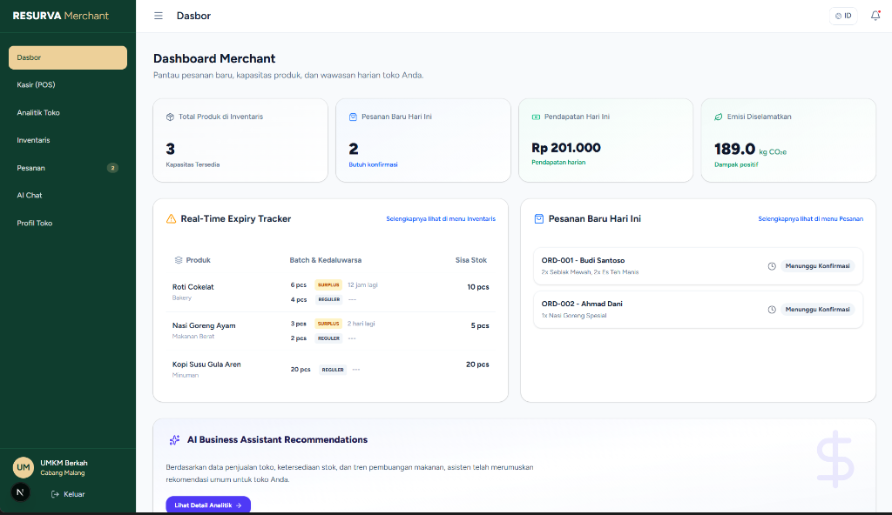

<div align="center">


# Resurva

**"Food waste is not just about emissions. It's about how much we value our food."**

[](https://nextjs.org/)
[](https://react.dev/)
[](https://tailwindcss.com/)
[](https://www.typescriptlang.org/)
[](https://polinema.ac.id/)
[](https://resurva.my.id/)

---


</div>

## 📌 Daftar Isi
1. [Tentang Resurva](#-tentang-resurva)
2. [Masalah yang Kami Lihat](#-masalah-yang-kami-lihat)
3. [Solusi yang Kami Tawarkan](#-solusi-yang-kami-tawarkan)
4. [Cara Kerja](#-cara-kerja)
5. [Fitur Utama](#-fitur-utama)
6. [Contoh Alur Penggunaan](#-contoh-alur-penggunaan)
7. [Dampak yang Ingin Dicapai](#-dampak-yang-ingin-dicapai)
8. [Teknologi](#-teknologi)
9. [Instalasi & Menjalankan Secara Lokal](#-instalasi--menjalankan-secara-lokal)
10. [Struktur Folder](#-struktur-folder)
11. [Demo](#-demo)
12. [Panduan Penggunaan / User Guide](#-panduan-penggunaan--user-guide)
13. [FAQ (Frequently Asked Questions)](#-faq-frequently-asked-questions)
14. [Lisensi & Catatan Proyek](#-lisensi--catatan-proyek)

---

## 🍃 Tentang Resurva

**Resurva** adalah Platform Digital Manajemen Bisnis dan Marketplace Surplus untuk Meningkatkan Produktivitas UMKM Pangan Solo Raya. Melalui modul dashboard bisnis berbasis web ini, pelaku usaha kuliner skala menengah-enterprise dapat mendigitalisasi operasional harian mereka, memantau masa kedaluwarsa stok secara real-time, memperoleh rekomendasi bisnis cerdas berbasis kecerdasan buatan (AI), serta menyalurkan produk surplus pangan yang hampir kedaluwarsa secara langsung ke pasar sekunder (Resurva Marketplace) guna menghindari kerugian biaya dan mengurangi kontribusi sampah makanan terhadap bumi.

---

## ⚠️ Masalah yang Kami Lihat

Indonesia menghadapi krisis timbulan sampah makanan (Food Loss and Waste/FLW) yang sangat besar. Permasalahan ini bukan sekadar soal sisa makanan, melainkan akibat dari rantai proses bisnis yang tidak terintegrasi dengan baik.

| Tantangan / Data Lapangan | Dampak bagi Bisnis & Lingkungan |
| :--- | :--- |
| **Krisis Food Waste Nasional**<br>Indonesia memproduksi 23-48 juta ton sampah makanan/tahun. | Kerugian ekonomi mencapai **Rp213-551 triliun/tahun** dan menyumbang **8-10% emisi gas rumah kaca global** (khususnya gas metana dari TPA). |
| **Konsentrasi UMKM Kuliner**<br>Terdapat sekitar **13.203 UMKM** di Surakarta dengan mayoritas bergerak di sektor makanan, minuman, dan perdagangan. | Timbulan sampah organik di tingkat regional Solo Raya sangat tinggi karena minimnya tata kelola produk sisa. |
| **Kurangnya Standar Stok & Analitik**<br>Riset ke UMKM lokal menunjukkan **100% belum punya standar restock** dan **100% masih mencatat secara manual**. | Keputusan bisnis berbasis perkiraan sering kali memicu **defisit bahan baku** atau **overstock** produk perishable yang berakhir kedaluwarsa. |
| **Proses Bisnis Terputus**<br>Manajemen inventaris manual tidak terhubung dengan rantai penjualan produk surplus. | Produk *near-expiry* terbuang menjadi sampah karena pelaku UMKM tidak memiliki wadah atau kanal promosi instan untuk menjualnya dengan harga diskon. |

---

## 💡 Solusi yang Kami Tawarkan

Aplikasi Web Resurva (Smart Business & Enterprise Dashboard) berfokus pada 3 pilar solusi utama:

1. **Efisiensi Operasional Terintegrasi**
   Menghubungkan proses Point of Sale (POS) langsung dengan pelacakan inventaris, mempermudah UMKM dalam pencatatan stok dan pelacakan masa kedaluwarsa barang secara otomatis tanpa proses manual yang lambat.
2. **Insight Bisnis Berbasis AI (AI-Driven Insights)**
   Menggantikan metode keputusan bisnis berbasis perkiraan. AI Assistant menganalisis data penjualan historis dan tren stok untuk memberikan rekomendasi restock optimal dan peringatan promosi produk yang hampir kedaluwarsa.
3. **Kanal Penyelamatan Surplus & Carbon Analytics**
   Menghubungkan langsung stok makanan surplus merchant ke platform Marketplace, serta mengonversi penjualan makanan surplus tersebut menjadi angka metrik kontribusi pengurangan emisi karbon (CO2e) yang terstandarisasi.

---

## 🔄 Cara Kerja

Berikut adalah alur perjalanan operasional pengguna di dalam ekosistem Resurva:


---

## 🛠️ Fitur Utama

| Fitur | Mengapa Penting |
| :--- | :--- |
| **Smart Inventory** | Melacak stok dan masa kedaluwarsa secara real-time dengan notifikasi visual berbasis rentang hari layak konsumsi untuk menghindari pembuangan bahan baku. |
| **Enterprise Dashboard** | Menyediakan ringkasan operasional bisnis multi-cabang secara terpusat untuk mempermudah pemantauan keuntungan, sisa stok, dan efisiensi limbah. |
| **Marketplace Surplus** | Menjadi kanal langsung untuk mengonversi barang sisa atau *near-expiry* menjadi pendapatan tambahan dengan menjualnya ke konsumen peduli lingkungan. |
| **POS (Point of Sale)** | Pencatatan penjualan kasir yang terintegrasi secara instan dengan data inventaris guna memperbarui kuantitas stok secara akurat di latar belakang. |
| **AI Business Assistant** | Memberikan rekomendasi restock harian dan taktik promosi penjualan berbasis pola data historis, meminimalkan keputusan tebakan manual. |
| **Carbon Impact Analytics** | Mengonversi berat makanan yang berhasil diselamatkan menjadi hitungan pengurangan emisi CO2e serta padanan visualnya (jarak tempuh mobil, dll) demi laporan keberlanjutan (SDGs). |

---

## 📖 Contoh Alur Penggunaan

Skenario naratif penggunaan dashboard bisnis Resurva:

1. **Pengisian Awal (Stok & POS):**
   Toko Roti *"Nexa Bakery"* memasukkan batch produksi harian roti manis sebanyak `50 pcs` dengan tanggal kedaluwarsa 2 hari ke depan pada modul **Smart Inventory**.
2. **Pencatatan Harian:**
   Sepanjang hari, penjualan roti dicatat langsung menggunakan modul **POS**. Kuantitas inventaris di dashboard berkurang secara real-time.
3. **Pemberitahuan Sistem:**
   Pada sore hari kedua, sistem mendeteksi sisa stok roti manis yang belum terjual sebanyak `15 pcs`. Status indikator kedaluwarsa berubah menjadi warna kuning (mendekati kedaluwarsa).
4. **Penerbitan Produk Surplus:**
   Pemilik toko menggunakan fitur **Marketplace Surplus** untuk langsung mempublikasikan `15 pcs` roti manis tersebut ke aplikasi konsumen dengan diskon sebesar `50%`.
5. **Penyelamatan & Konversi:**
   Konsumen (mahasiswa/discount hunter) membeli roti surplus tersebut melalui aplikasi mobile. Begitu transaksi selesai, dashboard pemilik menampilkan laporan kontribusi penyelamatan emisi karbon terhindar sebesar `1.88 kg CO2e` yang setara dengan menanam `0.03 pohon` atau menghemat `7.7 km` berkendara.

---

## 📈 Dampak yang Ingin Dicapai

Resurva menargetkan dampak nyata pada aspek ekonomi UMKM dan kelestarian lingkungan hidup:
*   **Reduksi Limbah Pangan (Food Waste Reduction):** Meminimalkan volume produk makanan layak konsumsi terbuang sia-sia ke tempat pembuangan akhir (TPA).
*   **Peningkatan Keuntungan UMKM (Cost Recovery):** Membantu memulihkan biaya modal dari produk sisa yang sebelumnya dianggap kerugian (loss) menjadi profit.
*   **Edukasi Lingkungan & Transparansi:** Memberikan kesadaran mengenai jejak karbon makanan.

### Metrik Dampak Utama yang Diukur:
- **Total Makanan yang Diselamatkan:** Kuantitas berat (kg) makanan surplus yang berhasil terjual.
- **Estimasi Emisi CO2e Terhindar:** Metrik akumulasi kg CO2e emisi gas metana yang berhasil dicegah.
- **Tingkat Efisiensi Biaya Operasional:** Persentase biaya modal yang berhasil dipulihkan oleh merchant mitra.
- **Jumlah UMKM Pangan Aktif:** Jumlah pelaku usaha Solo Raya yang mengadopsi sistem digitalisasi ini.

---

## 💻 Teknologi

Teknologi utama yang digunakan dalam membangun platform web Resurva:

- **Framework Inti:** [](https://nextjs.org/) (App Router & React 19)
- **Bahasa Pemrograman:** [](https://www.typescriptlang.org/)
- **Desain & Gaya Visual:** [](https://tailwindcss.com/)
- **Visualisasi Grafik:** [](https://www.chartjs.org/) & `react-chartjs-2`
- **Animasi Antarmuka:** [](https://gsap.com/) & `@gsap/react`
- **Integrasi Peta:** `leaflet` & `react-leaflet` (Untuk visualisasi sebaran merchant)
- **Komponen UI Modular:** `shadcn/ui` & `lucide-react` / `@hugeicons/react`
- **Integrasi Backend API:** Python FastAPI (Backend Core) — *koneksi API diatur melalui Client SDK internal*

---

## 🚀 Instalasi & Menjalankan Secara Lokal

### Prasyarat
Pastikan Anda telah menginstal perangkat lunak berikut:
*   [Node.js](https://nodejs.org/) (Versi LTS yang direkomendasikan, minimal v18+)
*   [Git](https://git-scm.com/)

### Langkah Instalasi

1.  **Clone Repositori:**
    ```bash
    git clone https://github.com/Nexa-Code-Studio/resurva_web.git
    cd resurva_web
    ```

2.  **Instalasi Dependensi:**
    Gunakan npm untuk menginstal semua package yang terdaftar:
    ```bash
    npm install
    ```

3.  **Konfigurasi Environment Variable:**
    Buat file `.env.local` atau `.env` di root direktori proyek, lalu tambahkan variabel berikut:
    ```env
    NEXT_PUBLIC_API_URL=https://api.resurva.my.id/api/v1
    ```
    *(Catatan: Anda dapat mengarahkan URL ini ke endpoint server lokal jika sedang menjalankan FastAPI backend secara mandiri)*

4.  **Menjalankan Mode Pengembangan (Local Dev Server):**
    ```bash
    npm run dev
    ```
    Setelah server aktif, buka browser Anda di alamat [http://localhost:3000](http://localhost:3000).

5.  **Membangun Proyek untuk Produksi:**
    ```bash
    npm run build
    ```
    Perintah ini akan membuat hasil build yang telah dioptimalkan di dalam folder `.next`.

6.  **Menjalankan Hasil Build Produksi:**
    ```bash
    npm run start
    ```

---

## 📁 Struktur Folder

Berikut adalah struktur folder utama dari proyek Next.js `resurva_web` ini:

```
resurva_web/
├── public/                  # Aset statis seperti gambar, ikon, dan logo
├── scripts/                 # Script deployment server (deploy_restart.sh)
└── src/                     # Source code utama aplikasi
    ├── app/                 # Halaman & Rute Next.js (App Router)
    │   ├── (auth)/          # Modul login, registrasi, & verifikasi akun
    │   ├── enterprise/      # Halaman & fitur dashboard multi-cabang (Enterprise)
    │   ├── merchant/        # Halaman & fitur dashboard operasional harian (Merchant)
    │   ├── superadmin/      # Panel kendali administrasi platform global
    │   ├── wrapped/         # Halaman kilas balik keberlanjutan bisnis
    │   ├── globals.css      # Gaya global Tailwind CSS v4
    │   ├── layout.tsx       # Root layout untuk struktur dokumen HTML dasar
    │   └── page.tsx         # Landing Page utama platform Resurva
    ├── components/          # Komponen UI yang dapat digunakan kembali
    │   ├── auth/            # Komponen khusus antarmuka autentikasi
    │   ├── enterprise/      # Komponen penyusun visualisasi data Enterprise
    │   ├── layout/          # Navigasi utama, sidebar dasbor, dan footer
    │   ├── merchant/        # Komponen fungsional input produk & stok
    │   └── ui/              # Atom komponen dasar (tombol, dialog, input, dsb.)
    └── lib/                 # Utilitas global dan handler API
        ├── contexts/        # Konteks global React (otentikasi, tema, dll.)
        ├── api.ts           # Axios / Fetch client untuk interaksi server
        └── utils.ts         # Utility helper umum (misalnya merge Tailwind class)
```

---

## 📺 Demo

*   **Link Aplikasi Live:** [https://resurva.my.id/](https://resurva.my.id/)
*   **Screenshot Tampilan Dashboard:**
    

---

## 📝 Panduan Penggunaan / User Guide

Berikut adalah langkah operasional bagi Merchant/UMKM untuk mengoperasikan Dashboard Resurva:

1.  **Daftar & Login Akun:**
    Buka landing page Resurva, klik tombol **Bermitra Dengan Kami** (atau melalui pendaftaran manual di form kemitraan). Lengkapi formulir informasi toko, lalu masuk menggunakan kredensial email dan kata sandi yang telah didaftarkan.
2.  **Mengisi Profil Bisnis:**
    Masuk ke bagian pengaturan profil untuk melengkapi titik lokasi koordinat maps toko via menu **Profil Toko** (`/merchant/profile`) agar terintegrasi dengan algoritma radius geo-location pada aplikasi konsumen.
3.  **Tambah Data Produk Baru:**
    Akses menu **Inventaris** (`/merchant/inventory`) dan klik tombol **Tambah Produk**. Masukkan informasi nama produk, kategori pangan (penting untuk perhitungan konversi emisi), unit stok awal, harga reguler, serta tanggal masa kedaluwarsa.
4.  **Memantau Indikator Stok:**
    Perhatikan warna indikator di daftar inventaris. Indikator **Merah** menandakan produk kedaluwarsa dalam < 24 jam, **Kuning** untuk < 48 jam, dan **Hijau** untuk produk bersisa waktu panjang.
5.  **Menjual ke Marketplace Surplus:**
    Untuk produk berstatus Kuning/Merah, aktifkan opsi **Pemicu Surplus Otomatis** atau ubah harganya secara manual. Tentukan persentase potongan harga diskon (misalnya 40%-60%), lalu konfirmasi. Produk akan terpublikasi otomatis ke aplikasi konsumen.
6.  **Memantau Rekomendasi AI:**
    Buka tab **AI Chat** (`/merchant/ai-chat`) untuk melihat pola analisis kebutuhan bahan baku minggu depan dan rekomendasi kuantitas restock produk guna mencegah overstock berulang.
7.  **Mengecek Dashboard Laporan Dampak Lingkungan:**
    Buka tab **Analitik Toko** (`/merchant/analytics`) secara berkala untuk mengunduh infografis total reduksi sampah organik (dalam kg) dan emisi karbon (CO2e) yang berhasil dicapai dari seluruh produk surplus terjual.

---

## 💬 FAQ (Frequently Asked Questions)

<details>
<summary><b>1. Apa itu platform Resurva secara umum?</b></summary>
Resurva adalah ekosistem digital sirkular hulu-ke-hilir yang menghubungkan bisnis kuliner (mitra merchant) dengan konsumen pencinta lingkungan melalui marketplace surplus makanan demi mengurangi timbulan sampah makanan dan melacak dampaknya terhadap lingkungan.
</details>

<details>
<summary><b>2. Siapa saja target pengguna utama platform web dashboard ini?</b></summary>
Dashboard web ditujukan untuk pemilik usaha kuliner, manajemen kafe/restoran (skala Merchant untuk operasional satu toko), serta pemilik bisnis skala besar multi-cabang (skala Enterprise untuk pemantauan menyeluruh dan laporan SDGs).
</details>

<details>
<summary><b>3. Bagaimana AI Business Assistant bekerja dalam memberikan rekomendasi?</b></summary>
AI Assistant memanfaatkan algoritma machine learning sederhana dan rule-based engine untuk menganalisis data transaksi masa lalu, tren penjualan mingguan, serta catatan limbah produk yang kedaluwarsa guna menghasilkan prediksi kuantitas produksi harian berikutnya yang disarankan.
</details>

<details>
<summary><b>4. Apakah data transaksi dan inventaris bisnis kami aman di platform ini?</b></summary>
Ya, seluruh transmisi data dari aplikasi web ke backend dienkripsi dengan standar keamanan tinggi (SSL/HTTPS). Pengaksesan dasbor merchant juga dibatasi oleh sistem autentikasi JWT token untuk mencegah kebocoran data sensitif, dengan database utama menggunakan PostgreSQL yang terisolasi.
</details>

<details>
<summary><b>5. Bagaimana produk surplus di dashboard web ini dapat dijangkau oleh pembeli?</b></summary>
Setiap kali merchant mengaktifkan status "surplus" untuk produknya, data tersebut akan dikirimkan secara instan ke backend dan disebarkan ke pengguna aplikasi mobile Resurva terdekat lewat notifikasi berbasis lokasi (GPS).
</details>

<details>
<summary><b>6. Apakah platform Resurva Merchant ini gratis untuk digunakan?</b></summary>
Pendaftaran awal dan fitur inventaris dasar disediakan secara gratis untuk UMKM kuliner. Kami mengenakan biaya komisi kecil (komisi per transaksi sukses) untuk setiap produk surplus yang berhasil diselamatkan/terjual melalui aplikasi mobile.
</details>

<details>
<summary><b>7. Bagaimana cara menghubungkan dashboard web ini dengan aplikasi mobile Resurva?</b></summary>
Sistem terhubung secara otomatis di backend PostgreSQL. Cukup gunakan akun merchant yang sama untuk mengontrol item produk, dan status ketersediaan item tersebut akan langsung tersinkronisasi di aplikasi mobile.
</details>

<details>
<summary><b>8. Bagaimana jika kami membutuhkan bantuan teknis atau dukungan lainnya?</b></summary>
Mitra merchant dapat mengakses menu pusat bantuan di dalam dashboard untuk berkomunikasi dengan tim teknis NexaCode atau mengirim email dukungan pelanggan resmi di support@resurva.my.id atau via WhatsApp Support resmi.
</details>

---

## 📄 Lisensi & Catatan Proyek

Sistem ini dikembangkan khusus sebagai bagian dari keikutsertaan kompetisi **BytesFest 2026** di Politeknik Negeri Malang oleh Tim **NexaCode**. Proyek ini bertujuan untuk menciptakan solusi nyata berbasis teknologi bagi kelestarian lingkungan dan ketahanan pangan nasional.

- **Lisensi**: Proprietary (BytesFest 2026)
- **Hak Cipta**: &copy; 2026 NexaCode. All rights reserved.
- **Tautan Repositori Terkait**:
  - [resurva_web (Smart Business Platform)](https://github.com/Nexa-Code-Studio/resurva_web)
  - [resurva_backend (FastAPI core APIs)](https://github.com/Nexa-Code-Studio/resurva_backend)
  - [resurva_mobile](https://github.com/Nexa-Code-Studio/resurva_mobile)


---

<div align="center">
    Made with ❤️ by <b>NexaCode Team</b> for a Sustainable Future 🌿
</div>

